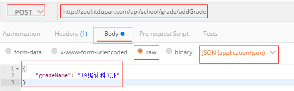

# 后台API接口开发文档

## 接口说明

- 接口基准地址：`http://zuul.itdupan.com/api/`
  - 示例：`http://zuul.itdupan.com/api/school/grade/findGrades`，其中api为zuul网关前缀，所有请求首先经过zuul网关，方便认证和授权，school为zuul转发到的微服务路径，/grade/findGrades为controller处理请求。
- 服务端已开启cors跨域支持
  - 只允许`http://hongfurui.itdupan.com`和`http://exam.itdupan.com`两个域名对`http://zuul.itdupan.com`进行跨域访问
- 认证统一使用toen认证，token携带在cookie中，cookieName为"HFR_TOKEN"（HFR为作者姓名字母首拼音，嘻嘻）
- 请求方式

```
GET 查询
POST 新增
PUT 更新
DELETE 删除
```

- 使用HttpStatus Code做标识状态

```
200 OK 响应成功
201 CREATED 新增或更新成功
204 DELETED 删除成功
400 BAD_REQUEST 请求參數不合法
401 UNAUTHORIZED 身份不合法
403 FORBIDDEN 权限不足
404 NOT_FOUND 資源服務器未找到
500 INTERNAL_SERVER_ERROR 服務器內部錯誤
```

添加 删除 修改失败将返回状态码自定义状态码：600

- 后台返回格式统一使用json格式，返回样式如下：

```
{
    "httpCode": 200,
    "message": "查询所有班级成功！",
    "data": [
        {
            "gradeId": 20,
            "gradeName": "16级软件工程2班"
        },
        {
            "gradeId": 21,
            "gradeName": "16级软件工程1班"
        }
    ]
}
```

- 捕获全局RuntimeException，返回样式如下： 

```
{
    "httpCode": 500,
    "message": "操作失败，系统未知异常，请尽快反馈给系统管理员！",
    "exceptionTime": "2020-03-12 17:32:55"
}
```

- 重点来了：vue中的form表单对应的数据模型post提交时提交数据为json格式，controller接收时添加@RequestBody，postman中测试样例如下图



## 系统管理部分API

### 用户

### 角色

### 权限

## 学校操作部分API

### 班级

#### 添加班级

- 请求路径：POST：`school/grade/addGrade`
- post请求参数

```
{
	"gradeName": "19级计科1班"
}
```

- 成功返回

```
{
    "httpCode": 201,
    "message": "添加班级成功！",
    "data": null
}
```

- 失败返回（班级名称不能重复）

```
{
    "httpCode": 600,
    "message": "班级已存在，不允许重复添加！",
    "data": null
}
```

#### 通过id删除班级

- 请求路径：DELETE：`school/grade/delGradeById` 		注：delete请求与get请求使用方式一样
- 参数说明
  - gradeId：班级id
- 成功返回

```
{
    "httpCode": 204,
    "message": "删除该班级成功！",
    "data": null
}
```

- 失败返回

```
{
    "httpCode": 600,
    "message": "删除失败，该班级可能被用户表或试卷表引用到！",
    "data": null
}
```

#### 更新班级

- 请求路径：PUT：`school/grade/updateGrade `		使用方法与post类似
- 参数说明

```
{
	"gradeId": 53,
	"gradeName": "软工"
}
```

- 成功返回

```
{
    "httpCode": 201,
    "message": "更新成功",
    "data": null
}
```

- 失败返回

```
{
    "httpCode": 600,
    "message": "修改失败，班级已存在！",
    "data": null
}
```

#### 通过id查询班级

- 请求路径：GET：`school/grade/findGradeById `
- 参数说明
  - gradeId：班级id
- 成功返回

```
{
    "httpCode": 200,
    "message": "查询成功！",
    "data": {
        "gradeId": 34,
        "gradeName": "15级英语1班"
    }
}
```

- 失败返回

```
{
    "httpCode": 600,
    "message": "用户不存在！",
    "data": null
}
```


#### 查询所有班级

- 请求路径：GET：`school/grade/findGrades `
- 成功返回

```
{
    "httpCode": 200,
    "message": "查询所有班级成功！",
    "data": [
        {
            "gradeId": 20,
            "gradeName": "16级软件工程2班"
        },
        {
            "gradeId": 21,
            "gradeName": "16级软件工程1班"
        }
    ]
}
```

#### 分页查询班级

- 请求路径：GET：`school/grade/findGradesByPage`
- 参数说明
  - page：当前页，可省略，默认值为1
  - rows：每页条数，额省略，默认值为10
  - gradeName：班级名，分页查询参数，可省略，省略为查询所有班级再分页
- 成功返回

```
{
    "httpCode": 200,
    "message": "查询成功！",
    "data": {
        "total": 5,
        "totalPage": 3,
        "list": [
            {
                "gradeId": 32,
                "gradeName": "18级计科2班"
            },
            {
                "gradeId": 33,
                "gradeName": "17级计科2班"
            }
        ]
    }
}
```

#### 通过名称查询班级列表

- 请求路径：GET：`school/grade/findGradesByGradeName`
- 参数说明
  - gradeName：查询参数
- 成功返回

```
{
    "httpCode": 200,
    "message": "查询成功",
    "data": [
        {
            "gradeId": 28,
            "gradeName": "19级计科2班"
        },
        {
            "gradeId": 32,
            "gradeName": "19级计科2班"
        }
    ]
}
```

### 科目

#### 添加科目

- 请求路径：POST：`school/subject/addSubject`
- post请求参数

```
{
	"subjectName": "c#"
}
```

- 成功返回

```
{
    "httpCode": 201,
    "message": "添加成功！",
    "data": null
}
```

- 失败返回（科目名称不能重复）

```
{
    "httpCode": 600,
    "message": "科目已存在，不允许重复添加！",
    "data": null
}
```

#### 通过id删除科目

- 请求路径：DELETE：`school/subject/delSubjectById` 		注：delete请求与get请求使用方式一样
- 参数说明
  - subjectId：科目id
- 成功返回

```
{
    "httpCode": 204,
    "message": "删除成功！",
    "data": null
}
```

- 失败返回

```
{
    "httpCode": 600,
    "message": "删除失败，该班级可能被试题表或试卷表引用到！",
    "data": null
}
```

#### 更新科目

- 请求路径：PUT：`school/subject/updateSubject `		使用方法与post类似
- 参数说明

```
{
	"subjectId": 5,
	"subjectName": "c++"
}
```

- 成功返回

```
{
    "httpCode": 201,
    "message": "修改成功！",
    "data": null
}
```

- 失败返回

```
{
    "httpCode": 600,
    "message": "修改失败，科目已存在！",
    "data": null
}
```

#### 通过id查询科目

- 请求路径：GET：`school/subject/findSubjectById `
- 参数说明
  - subjectId：科目id
- 成功返回

```
{
    "httpCode": 200,
    "message": "查询成功！",
    "data": {
        "subjectId": 1,
        "subjectName": "java"
    }
}
```

- 失败返回

```
{
    "httpCode": 600,
    "message": "科目不存在！",
    "data": null
}
```

#### 查询所有科目

- 请求路径：GET：`school/subject/findSubjects `
- 成功返回

```
{
    "httpCode": 200,
    "message": "查询成功！",
    "data": [
        {
            "subjectId": 1,
            "subjectName": "java"
        },
        {
            "subjectId": 2,
            "subjectName": "操作系统"
        }
    ]
}
```

#### 分页查询科目

- 请求路径：GET：`school/subject/findSubjectsByPage`
- 参数说明
  - page：当前页，可省略，默认值为1
  - rows：每页条数，额省略，默认值为10
  - subjectName：科目名，分页查询参数，可省略，省略为查询所有科目再分页
- 成功返回

```
{
    "httpCode": 200,
    "message": "查询成功！",
    "data": {
        "total": 5,
        "totalPage": 1,
        "list": [
            {
                "subjectId": 1,
                "subjectName": "java"
            },
            {
                "subjectId": 2,
                "subjectName": "操作系统"
            },
            {
                "subjectId": 3,
                "subjectName": "计算机组成原理"
            },
            {
                "subjectId": 4,
                "subjectName": "数据结构"
            },
            {
                "subjectId": 5,
                "subjectName": "c++"
            }
        ]
    }
}
```

#### 通过名称查询科目列表

- 请求路径：GET：`school/subject/findSubjectsBySubjectName`
- 参数说明
  - subjectName：查询参数
- 成功返回

```
{
    "httpCode": 200,
    "message": "查询成功！",
    "data": [
        {
            "subjectId": 4,
            "subjectName": "数据结构"
        },
        {
            "subjectId": 4,
            "subjectName": "数据结构"
        }
    ]
}
```

## 考试部分API

### 试题

###试卷